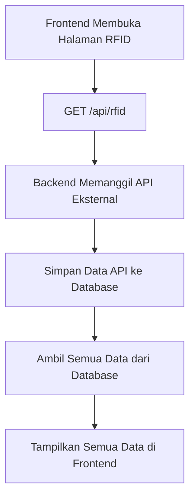
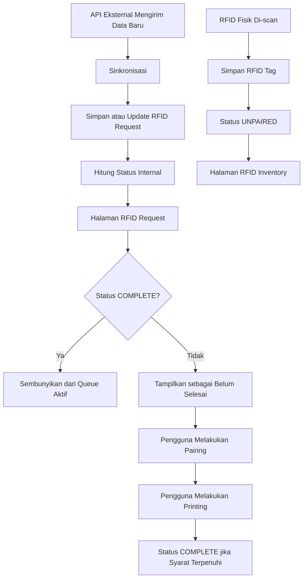
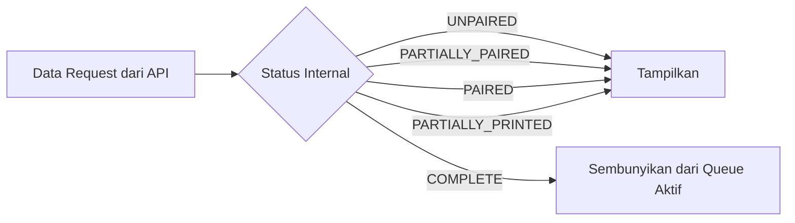
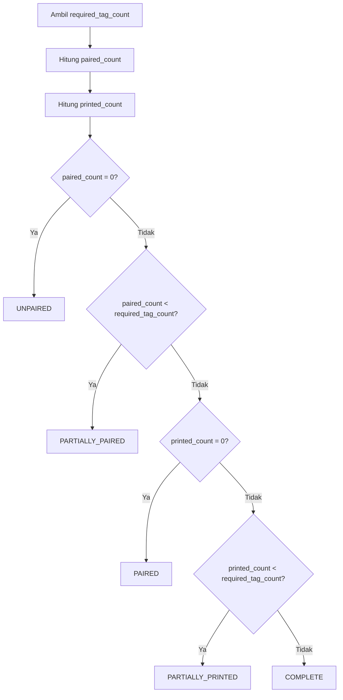
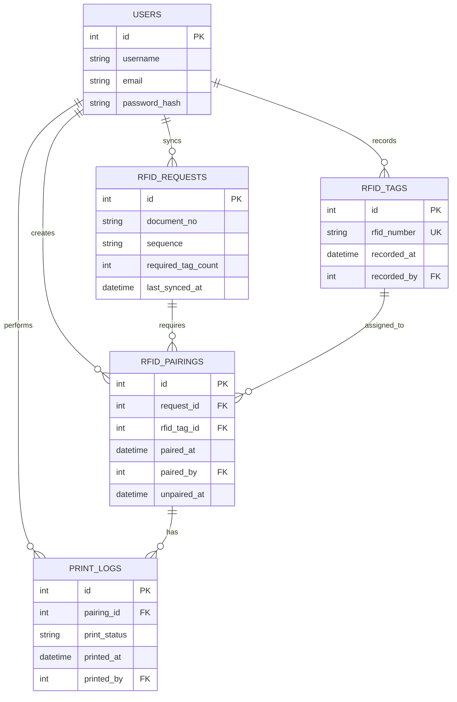
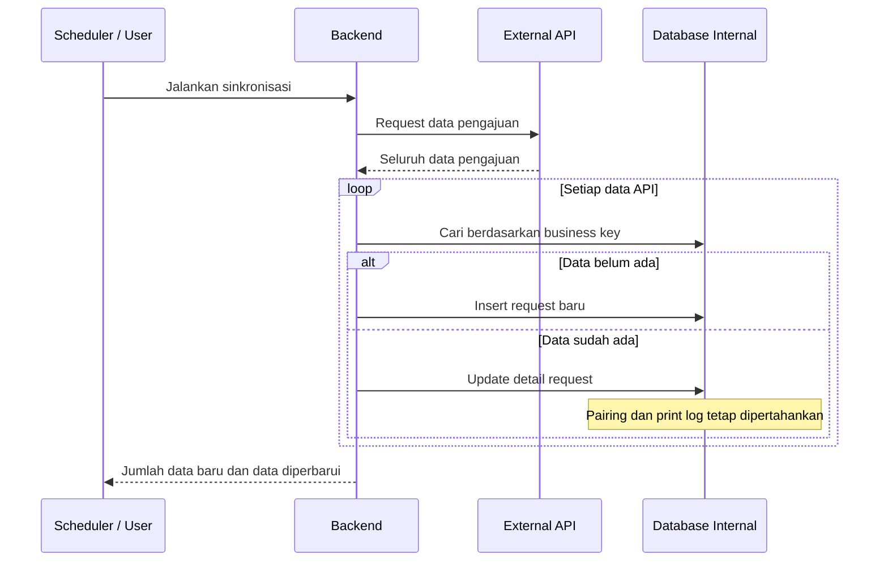
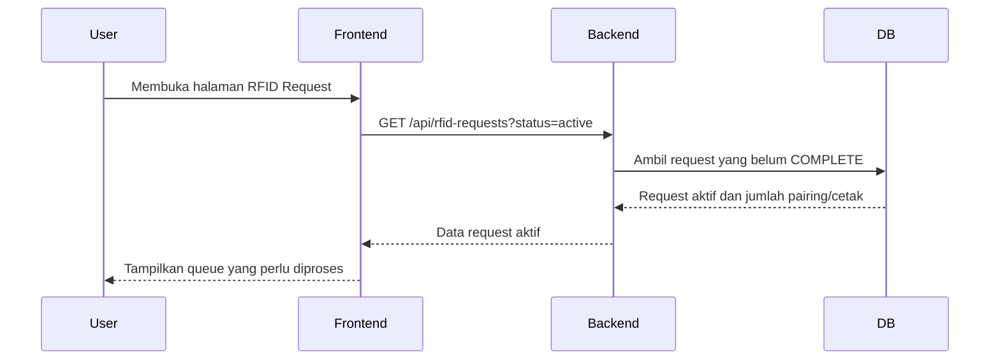

# URS — RFID Administration System

## 1. Informasi Dokumen

| Item | Isi |
|---|---|
| Nama sistem | RFID Administration System |
| Tujuan | Menghubungkan data pengajuan dari API eksternal dengan RFID tag fisik |
| Pengguna utama | Admin / Operator RFID |
| Sumber data pengajuan | API sistem eksternal |
| Sumber data RFID | RFID scanner atau input manual |
| Status proses | Dikelola oleh database internal |
| Jenis dokumen | User Requirement Specification |

---

## 2. Latar Belakang

Sistem eksternal menyediakan data pengajuan RFID secara terus-menerus melalui API.

Data dari API bersifat historis dan akan terus bertambah. Data yang dikirim API dapat berupa:

- Pengajuan baru.
- Pengajuan yang sudah pernah diproses.
- Pengajuan yang sudah dipasangkan dengan RFID.
- Pengajuan yang sudah dicetak.
- Pengajuan yang sudah selesai.

API eksternal tidak menyediakan status proses RFID. Oleh karena itu, sistem ini harus menyimpan status proses secara internal.

Sistem ini bertugas untuk:

1. Mengambil data pengajuan dari API eksternal.
2. Menyimpan data pengajuan ke database internal.
3. Mencatat RFID tag fisik.
4. Memasangkan RFID dengan nomor dokumen.
5. Mencatat proses pencetakan.
6. Menentukan status proses secara internal.
7. Menampilkan hanya data yang masih perlu diproses pada halaman RFID Request.

---

## 3. Tujuan Sistem

Sistem harus membantu pengguna mengetahui:

- Pengajuan mana yang belum memiliki RFID.
- Pengajuan mana yang sudah memiliki RFID.
- Pengajuan mana yang sudah dicetak.
- Pengajuan mana yang sudah selesai.
- RFID mana yang belum memiliki pemilik.
- RFID mana yang sudah digunakan.
- Data mana yang masih perlu ditindaklanjuti.

---

## 4. Definisi Istilah

| Istilah | Definisi |
|---|---|
| Request | Data pengajuan RFID dari sistem eksternal |
| Document Number | Nomor dokumen pengajuan |
| RFID Tag | Nomor RFID fisik yang dibaca dari scanner |
| Pairing | Proses menghubungkan RFID dengan dokumen |
| Unpaired | RFID belum memiliki dokumen |
| Paired | RFID sudah dihubungkan dengan dokumen |
| Printed | RFID atau label sudah dicetak |
| Complete | Seluruh proses dokumen sudah selesai |
| Sync | Proses mengambil dan menyimpan data dari API eksternal |
| Processing Queue | Daftar data yang masih membutuhkan tindakan pengguna |

---

## 5. Ruang Lingkup

### 5.1 Termasuk dalam Sistem

- Login dan autentikasi pengguna.
- Sinkronisasi data pengajuan dari API.
- Penyimpanan data pengajuan.
- Pencatatan RFID tag.
- Pairing RFID dengan dokumen.
- Pencatatan proses cetak.
- Perhitungan status proses.
- Filter data belum selesai.
- Riwayat aktivitas.
- Dashboard monitoring.

### 5.2 Tidak Termasuk dalam Sistem

- Mengubah data utama pada sistem eksternal.
- Mengubah status pada sistem eksternal.
- Membuat pengajuan RFID baru ke sistem eksternal.
- Menggantikan fungsi sistem sumber pengajuan.
- Membaca RFID langsung apabila perangkat scanner belum terintegrasi.

---

## 6. Kondisi Sistem Saat Ini



Masalah dari implementasi saat ini:

1. Semua data ditampilkan tanpa membedakan status.
2. Belum ada data pairing yang terpisah.
3. Belum ada status printed.
4. Belum ada status complete.
5. Belum ada relasi antara request dan RFID fisik.
6. Data API yang sama dapat terus muncul sebagai data aktif.
7. Belum ada filter berdasarkan status proses di backend.

---

## 7. Kondisi Sistem yang Diharapkan



---

## 8. Aturan Utama Penampilan Data

### 8.1 Prinsip Dasar

Data dari API tidak boleh langsung dianggap sebagai data baru.

Setiap data API harus dicocokkan dengan data request yang sudah tersimpan di database internal menggunakan business key yang unik.

Business key yang disarankan:

```text
document_no + sequence
```

Apabila nomor dokumen sudah dijamin unik oleh sistem eksternal, dapat digunakan:

```text
document_no
```

Business key ini harus dikonfirmasi berdasarkan kontrak API eksternal.

### 8.2 Definisi Belum Diproses

Rekomendasi definisi:

> Data dianggap belum diproses apabila status internalnya belum `COMPLETE`.

Dengan aturan tersebut, halaman RFID Request menampilkan:

- `UNPAIRED`
- `PARTIALLY_PAIRED`
- `PAIRED`
- `PARTIALLY_PRINTED`

Halaman tersebut menyembunyikan:

- `COMPLETE`

Data `COMPLETE` tidak dihapus dan tetap tersedia di halaman History.



Jika aturan bisnis menetapkan bahwa request dianggap selesai segera setelah pairing, filter dapat diubah agar hanya menampilkan `UNPAIRED` dan `PARTIALLY_PAIRED`. Keputusan ini harus ditetapkan oleh pemilik proses sebelum implementasi final.

---

## 9. Perhitungan Status Request

Status sebaiknya dihitung dari kondisi pairing dan printing, bukan diinput bebas oleh pengguna.

Contoh request yang membutuhkan tiga RFID:

| Required Tag | Paired Tag | Printed Tag | Status |
|---:|---:|---:|---|
| 3 | 0 | 0 | `UNPAIRED` |
| 3 | 1 | 0 | `PARTIALLY_PAIRED` |
| 3 | 3 | 0 | `PAIRED` |
| 3 | 3 | 2 | `PARTIALLY_PRINTED` |
| 3 | 3 | 3 | `COMPLETE` |

Formula:

```text
Jika paired_count = 0
    status = UNPAIRED

Jika paired_count < required_tag_count
    status = PARTIALLY_PAIRED

Jika paired_count = required_tag_count
dan printed_count = 0
    status = PAIRED

Jika printed_count < required_tag_count
    status = PARTIALLY_PRINTED

Jika printed_count = required_tag_count
    status = COMPLETE
```



---

## 10. Kebutuhan Fungsional

### FR-001 — Login

Sistem harus menyediakan login menggunakan username atau email dan password.

Login yang berhasil harus menghasilkan sesi atau token autentikasi.

### FR-002 — Proteksi Halaman

Halaman dashboard, RFID Request, RFID Inventory, Pairing, Printing, dan History hanya dapat diakses oleh pengguna yang sudah login.

### FR-003 — Sinkronisasi API

Sistem harus dapat mengambil data dari API eksternal melalui sinkronisasi otomatis maupun manual.

Sinkronisasi harus idempotent: dijalankan berkali-kali tidak boleh membuat data duplikat.

### FR-004 — Penyimpanan Request

Setiap request dari API harus disimpan di database internal dengan ID internal dan business key yang unik.

Data internal seperti pairing, printing, dan audit tidak boleh ditimpa oleh proses sinkronisasi.

### FR-005 — Pencatatan RFID

Pengguna dapat merekam RFID yang belum memiliki dokumen. Sistem harus menolak RFID kosong dan RFID duplikat.

### FR-006 — Pairing RFID

Pengguna dapat memasangkan RFID dengan request selama request dan RFID valid serta belum digunakan.

Jumlah pairing tidak boleh melebihi jumlah RFID yang dibutuhkan request.

### FR-007 — Printing

Pengguna hanya dapat mencetak data yang sudah paired. Sistem harus mencatat status, waktu, pengguna, dan error pencetakan.

### FR-008 — Filter RFID Request

Halaman RFID Request secara default hanya mengambil request yang statusnya belum `COMPLETE`.

Query konseptual:

```sql
SELECT *
FROM rfid_requests
WHERE internal_status <> 'COMPLETE'
ORDER BY last_synced_at DESC;
```

Jika status dihitung secara dinamis:

```sql
SELECT
    r.id,
    r.document_no,
    r.sequence,
    r.required_tag_count,
    COUNT(DISTINCT p.id) AS paired_count,
    COUNT(DISTINCT CASE
        WHEN p.printed_at IS NOT NULL THEN p.id
    END) AS printed_count
FROM rfid_requests r
LEFT JOIN rfid_pairings p
    ON p.request_id = r.id
    AND p.unpaired_at IS NULL
GROUP BY r.id
HAVING printed_count < r.required_tag_count
ORDER BY r.last_synced_at DESC;
```

### FR-009 — History

Request berstatus `COMPLETE` tidak dihapus. Data tersebut tersedia melalui halaman History atau Completed Requests.

### FR-010 — Audit Log

Sistem harus mencatat sinkronisasi, perekaman RFID, pairing, pembatalan pairing, printing, pembatalan printing, dan perubahan password.

---

## 11. Rancangan Data

### 11.1 Tabel `users`

```text
id
username
email
password_hash
created_at
updated_at
```

### 11.2 Tabel `rfid_requests`

```text
id
external_id
document_no
sequence
required_tag_count
location
category
transporter
request_date
vehicle_number
vehicle_brand
vehicle_type
color
year
tonnage
amount
raw_payload
last_synced_at
created_at
updated_at
```

Constraint yang disarankan:

```text
UNIQUE(document_no, sequence)
```

### 11.3 Tabel `rfid_tags`

```text
id
rfid_number
recorded_by
recorded_at
is_active
created_at
updated_at
```

Constraint:

```text
UNIQUE(rfid_number)
```

### 11.4 Tabel `rfid_pairings`

```text
id
request_id
rfid_tag_id
paired_by
paired_at
unpaired_by
unpaired_at
created_at
updated_at
```

Satu RFID hanya boleh memiliki satu pairing aktif.

### 11.5 Tabel `print_logs`

```text
id
pairing_id
print_status
printed_by
printed_at
error_message
created_at
```

### 11.6 Entity Relationship Diagram



---

## 12. Proses Sinkronisasi API



Aturan sinkronisasi:

1. Data lama tidak boleh dihapus hanya karena sudah complete.
2. Data pairing tidak boleh hilang ketika request di-update.
3. Data printing tidak boleh hilang ketika sinkronisasi dilakukan.
4. Field dari API boleh diperbarui.
5. Field internal hanya boleh dikelola sistem internal.
6. Jika API gagal, data lama tetap tersedia.
7. Sistem harus mencatat waktu sinkronisasi terakhir.
8. Sistem harus mencatat error sinkronisasi.

---

## 13. Proses Menampilkan RFID Request



Response API yang disarankan:

```json
{
  "data": [
    {
      "id": 123,
      "document_no": "DOC-2026-001",
      "sequence": "1",
      "required_tag_count": 2,
      "paired_count": 1,
      "printed_count": 0,
      "status": "PARTIALLY_PAIRED",
      "last_synced_at": "2026-09-14T10:00:00Z"
    }
  ],
  "meta": {
    "total": 1,
    "filter": "active"
  }
}
```

Status sebaiknya dihitung di backend agar aturan bisnis tidak berbeda antara frontend dan backend.

---

## 14. Rancangan Endpoint

### Authentication

```text
POST /api/auth/login
POST /api/auth/register
POST /api/auth/change-password
POST /api/auth/logout
GET  /api/auth/me
```

### Request

```text
GET  /api/rfid-requests
GET  /api/rfid-requests/:id
POST /api/rfid-requests/sync
```

Contoh filter:

```text
GET /api/rfid-requests?status=active
GET /api/rfid-requests?status=complete
GET /api/rfid-requests?document_no=DOC-001
```

### RFID Inventory

```text
GET  /api/rfid-tags
POST /api/rfid-tags
GET  /api/rfid-tags/unpaired
```

### Pairing

```text
GET    /api/pairings
POST   /api/pairings
DELETE /api/pairings/:id
```

### Printing

```text
GET  /api/printings/pending
POST /api/printings
GET  /api/printings/history
```

---

## 15. Tampilan Halaman RFID Request

Kolom minimum:

| Kolom | Keterangan |
|---|---|
| No | Nomor urut |
| Document Number | Nomor dokumen |
| Sequence | Urutan dokumen |
| Location | Lokasi |
| Category | Kategori |
| Required Tags | Jumlah RFID yang dibutuhkan |
| Paired Tags | Jumlah RFID yang sudah dipasangkan |
| Printed Tags | Jumlah RFID yang sudah dicetak |
| Status | Status proses |
| Last Sync | Waktu sinkronisasi terakhir |
| Action | Detail, Pair, atau Print |

Filter:

- Search nomor dokumen.
- Filter status.
- Filter tanggal.
- Filter lokasi.
- Filter data aktif.
- Filter data complete.

Default filter:

```text
status = active
```

Dengan definisi:

```text
status IN (
  'UNPAIRED',
  'PARTIALLY_PAIRED',
  'PAIRED',
  'PARTIALLY_PRINTED'
)
```

---

## 16. Kriteria Penerimaan

### AC-001 — Data API Baru

- Data pengajuan baru tersimpan di database.
- Data muncul di halaman RFID Request.
- Status awal adalah `UNPAIRED`.

### AC-002 — Sinkronisasi Ulang

- Sinkronisasi dua kali tidak menghasilkan duplikasi.
- Request lama tetap memiliki pairing dan print log.
- Data detail boleh diperbarui dari API.

### AC-003 — Request Complete

- Request dengan seluruh RFID sudah paired dan printed mendapat status `COMPLETE`.
- Request tersebut tidak muncul di daftar aktif.
- Request tetap terlihat di halaman History.

### AC-004 — Request Sebagian

- Request yang membutuhkan tiga RFID tetapi baru memiliki satu pairing tetap muncul.
- Statusnya adalah `PARTIALLY_PAIRED`.
- Jumlah kebutuhan dan jumlah pairing ditampilkan.

### AC-005 — RFID Belum Berpasangan

- RFID baru muncul di RFID Inventory.
- RFID memiliki status `UNPAIRED`.
- RFID dapat dipilih saat proses pairing.

### AC-006 — RFID Duplikat

- RFID yang sudah terdaftar tidak boleh disimpan kembali.
- Sistem menampilkan pesan error yang jelas.

### AC-007 — Pairing Duplikat

- RFID yang memiliki pairing aktif tidak boleh dipasangkan kembali.
- Satu request tidak boleh melebihi jumlah RFID yang dibutuhkan.

### AC-008 — Pencetakan

- Hanya data paired yang dapat dicetak.
- Hasil cetak dicatat.
- Setelah seluruh data tercetak, status berubah menjadi `COMPLETE`.

### AC-009 — API Error

- Jika API tidak dapat diakses, data terakhir dari database tetap tampil.
- Sistem mencatat error sinkronisasi.
- User mendapatkan informasi bahwa data belum diperbarui.

---

## 17. Skenario Contoh

Misalnya API mengirim:

```text
Document Number: DOC-1001
Required RFID: 2
```

Prosesnya:

| Tahap | Paired | Printed | Status |
|---|---:|---:|---|
| Request masuk dari API | 0 | 0 | `UNPAIRED` |
| RFID pertama dipasangkan | 1 | 0 | `PARTIALLY_PAIRED` |
| RFID kedua dipasangkan | 2 | 0 | `PAIRED` |
| RFID pertama dicetak | 2 | 1 | `PARTIALLY_PRINTED` |
| RFID kedua dicetak | 2 | 2 | `COMPLETE` |

Setelah tahap terakhir:

- Data tidak tampil lagi di queue aktif.
- Data tetap tersimpan di database.
- Data dapat dilihat di History.
- Data API yang masuk kembali tidak membuat request baru.

---

## 18. Urutan Development

### Tahap 1 — Authentication

1. Buat token atau session login.
2. Simpan token sesuai standar keamanan aplikasi.
3. Buat middleware autentikasi backend.
4. Lindungi endpoint backend.
5. Lindungi route frontend.
6. Buat fitur change password.
7. Perbaiki proses logout.

### Tahap 2 — Database

1. Buat tabel `rfid_requests`.
2. Buat tabel `rfid_tags`.
3. Buat tabel `rfid_pairings`.
4. Buat tabel `print_logs`.
5. Tambahkan foreign key dan unique constraint.

### Tahap 3 — Sinkronisasi Request

1. Ambil data API.
2. Tentukan business key.
3. Insert data baru.
4. Update data lama.
5. Jangan menimpa data internal.
6. Catat waktu sinkronisasi.
7. Catat kegagalan sinkronisasi.

### Tahap 4 — RFID Inventory

1. Buat form input atau scan RFID.
2. Simpan RFID.
3. Tolak RFID duplikat.
4. Tampilkan RFID `UNPAIRED`.

### Tahap 5 — Pairing

1. Tampilkan request aktif.
2. Tampilkan RFID yang belum digunakan.
3. Buat form pairing.
4. Validasi jumlah RFID.
5. Simpan user dan timestamp.
6. Hitung status request.

### Tahap 6 — Printing

1. Tampilkan request yang sudah paired.
2. Buat proses cetak.
3. Simpan print log.
4. Hitung status `PRINTED` atau `COMPLETE`.

### Tahap 7 — History dan Dashboard

1. Tampilkan request complete.
2. Tampilkan RFID unpaired.
3. Tampilkan jumlah request per status.
4. Tambahkan audit log.
5. Tambahkan filter dan pencarian.

---

## 19. Prinsip Implementasi

- API eksternal adalah sumber data pengajuan.
- Database internal adalah sumber status proses.
- RFID tag dapat direkam sebelum dokumen tersedia.
- Pairing adalah proses yang menghubungkan RFID dan dokumen.
- Status tidak boleh diinput bebas tanpa validasi.
- Semua perubahan penting harus memiliki user dan timestamp.
- Data dari API tidak boleh menimpa data pairing atau pencetakan.
- Satu RFID tidak boleh digunakan untuk lebih dari satu pairing aktif.
- Proses sinkronisasi harus aman dijalankan berkali-kali.
- Data `COMPLETE` disembunyikan dari queue aktif, bukan dihapus.

---

## 20. Kesimpulan

```text
API terus mengirim seluruh data pengajuan
                ↓
Database internal menyimpan data tersebut secara permanen
                ↓
Status proses dihitung dari pairing dan printing internal
                ↓
Halaman RFID Request hanya mengambil data yang belum COMPLETE
                ↓
Data COMPLETE tersedia di halaman History
```

Data yang sudah dipairing tidak perlu dihapus dari database dan tidak boleh dianggap sebagai data baru ketika API mengirimkannya kembali. Sistem cukup mencari data berdasarkan business key, mempertahankan relasi pairing dan printing, lalu menampilkannya hanya jika prosesnya belum `COMPLETE`.

